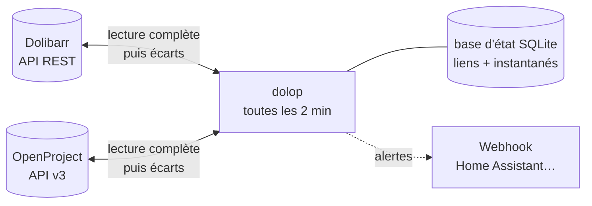

<h1 align="center">sync-dolibarr-openproject</h1>

<p align="center">
  <strong>Synchronisation bidirectionnelle entre Dolibarr et OpenProject</strong><br>
  projets, membres, tâches et temps passés : saisis une seule fois, n'importe où.
</p>

<p align="center">
  <a href="https://github.com/REWA54/sync-dolibarr-openproject/actions/workflows/ci.yml"></a>
  <a href="https://github.com/REWA54/sync-dolibarr-openproject/actions/workflows/codeql.yml"></a>
  <a href="https://scorecard.dev/viewer/?uri=github.com/REWA54/sync-dolibarr-openproject"></a>
  <a href="LICENSE"></a>
  
  <a href="https://github.com/REWA54/sync-dolibarr-openproject/pkgs/container/sync-dolibarr-openproject"></a>
</p>

> **In English.** A self-hosted service that keeps [Dolibarr ERP](https://www.dolibarr.org) (v24) and
> [OpenProject](https://www.openproject.org) (v17) in sync, both ways: users, projects, project members,
> tasks ↔ work packages and time entries, plus OpenProject comments copied into Dolibarr task notes.
> It runs as a single hardened Docker container, polls both REST APIs every two minutes and never
> deletes anything without a confirmed 404 and a circuit breaker. Documentation is in French;
> commands and configuration are language-neutral. AI agents: start with [`AGENTS.md`](AGENTS.md).

---

## Sommaire

- [Ce qui est synchronisé](#ce-qui-est-synchronisé)
- [Comment ça marche](#comment-ça-marche)
- [Garde-fous](#garde-fous)
- [Installation en 5 étapes](#installation-en-5-étapes)
- [Configuration](#configuration)
- [Commandes](#commandes)
- [Exploitation](#exploitation)
- [Sécurité](#sécurité)
- [Développement](#développement)
- [Licence](#licence)

## Ce qui est synchronisé

| Dolibarr | OpenProject | Sens |
|---|---|---|
| Utilisateurs | Utilisateurs (reconnus par leur e-mail) | ↔ |
| Tiers du projet | Champ texte « Client » du projet | ↔ (le texte est rapproché du tiers) |
| Projets | Projets | ↔ (une suppression devient une clôture ou un archivage) |
| Contacts internes du projet | Membres | ↔ |
| Tâches | Lots de travail | ↔ |
| Temps passés | Temps | ↔ (Dolibarr fait foi sur un temps facturé) |
| Note privée de la tâche | Commentaires du lot | ← seulement |

Versions éprouvées : **Dolibarr 24.0** et **OpenProject 17.8**.

## Comment ça marche



À chaque cycle, le service lit **tout**, des deux côtés, puis compare chaque objet relié à deux
instantanés : ce qu'il a vu en dernier dans Dolibarr, et ce qu'il a vu en dernier dans OpenProject.

- ce qui n'a changé que d'un côté est recopié de l'autre ;
- ce qui a changé des deux côtés est tranché par la date de modification, et une alerte part ;
- ce qui vient d'être écrit ne revient jamais en écho, même quand les formats diffèrent (HTML ↔ Markdown).

OpenProject n'émet aucun webhook quand on modifie ou supprime un temps : relire l'état complet est
le seul moyen de ne rien rater, même après une panne. Détail des choix : en-têtes de
[`reconciliation.py`](src/dolop/reconciliation.py) et [`cycle.py`](src/dolop/cycle.py).

## Garde-fous

- **Suppression confirmée** : un objet absent n'est tenu pour supprimé qu'après un accès direct qui répond 404. Un refus d'accès n'est jamais pris pour une suppression.
- **Disjoncteur** : plus de 5 suppressions prévues, ou des projets qui disparaissent tous d'un coup, et le cycle s'arrête **avant toute écriture**, avec une alerte.
- **Pas de doublon** : chaque création est notée « en cours » avant d'être faite, l'identifiant du jumeau est embarqué dans l'objet, et un verrou empêche deux cycles simultanés.
- **Simulation** : `dolop simuler` montre chaque écriture prévue sans rien toucher ; `dolop annuler <cycle>` défait les créations d'un cycle.
- **Projets gelés** : les tâches et les temps d'un projet clos ou archivé ne bougent plus.
- **Résilience** : relances sur panne passagère, service qui survit à toute erreur, sauvegarde quotidienne de la base d'état, sonde de santé Docker.
- **Alertes** par webhook, rappelées au plus une fois par 24 h, avec un message de rétablissement.

## Installation en 5 étapes

Prérequis : Docker 24 ou plus récent, un accès administrateur à Dolibarr et à OpenProject, et un
réseau d'où le conteneur joint les deux API. Aucun port entrant n'est nécessaire.

**1. Préparer Dolibarr et OpenProject** (environ 15 minutes, tout se fait dans les interfaces) :
comptes techniques, jetons d'API, champs personnalisés. Suivre [`docs/preparation.md`](docs/preparation.md).

**2. Récupérer les deux fichiers de déploiement** dans un dossier dédié :

```sh
mkdir -p /opt/dolop && cd /opt/dolop
curl -fsSLO https://raw.githubusercontent.com/REWA54/sync-dolibarr-openproject/master/compose.yaml
curl -fsSL -o .env https://raw.githubusercontent.com/REWA54/sync-dolibarr-openproject/master/compose.env.exemple
mkdir -p donnees && sudo chown 1000:1000 donnees && chmod 600 .env
```

**3. Renseigner `.env`** : les deux adresses, les deux jetons, l'étiquette d'image
(la [dernière version](https://github.com/REWA54/sync-dolibarr-openproject/releases), jamais `latest`)
et le réseau Docker partagé avec Dolibarr et OpenProject. Si les deux outils sont joignables par leur
adresse publique, un réseau dédié suffit : `docker network create dolop`.

**4. Vérifier, puis simuler** (lecture seule, rien n'est écrit) :

```sh
docker compose run --rm sync-dolibarr-openproject dolop verifier   # tout doit être ✅
docker compose run --rm sync-dolibarr-openproject dolop simuler    # ce que le premier cycle ferait
```

**5. Démarrer** :

```sh
docker compose up -d
docker compose logs -f                                   # un cycle toutes les 2 minutes
docker exec sync-dolibarr-openproject dolop rapport      # liens, derniers cycles, alertes
```

Au bout de quelques minutes, `docker ps` doit afficher le conteneur `healthy`.

## Configuration

Par variables d'environnement. Chaque secret peut aussi être lu dans un fichier (secrets Docker) :
`DOLIBARR_API_KEY_FILE=/run/secrets/dolibarr` à la place de `DOLIBARR_API_KEY`. Une valeur invalide
arrête le service au démarrage avec un message clair, plutôt que de le laisser mal tourner.

| Variable | Défaut | Rôle |
|---|---|---|
| `DOLIBARR_URL`, `DOLIBARR_API_KEY` | — | API Dolibarr (compte technique) |
| `OPENPROJECT_URL`, `OPENPROJECT_API_KEY` | — | API OpenProject (compte technique administrateur) |
| `OPENPROJECT_HOST` | — | en-tête Host si l'URL est interne (`http://openproject-proxy`) |
| `EXCLURE_LOGINS` | `admin` | comptes jamais synchronisés, ni eux ni leurs temps (administrateurs, comptes techniques) |
| `ALERTE_WEBHOOK_URL` | — | webhook d'alerte `{"title", "message"}` ; sinon alertes dans le journal seulement |
| `OPENPROJECT_TYPE` | `Task` | type des lots créés depuis Dolibarr (`Tache` dans une instance en français) |
| `OPENPROJECT_ROLE_CHEF` / `_CONTRIBUTEUR` | `Project admin` / `Member` | rôles OpenProject des chefs et contributeurs |
| `OPENPROJECT_ACTIVITE` | — | identifiant d'activité imposé aux temps créés dans OpenProject |
| `DOLIBARR_ATTRIBUT` | `openproject_id` | code de l'attribut supplémentaire (projets et tâches) |
| `OPENPROJECT_CHAMP_REF` | `ID Dolibarr` | nom du champ personnalisé (projets, lots, temps) |
| `OPENPROJECT_CHAMP_CLIENT` | `Client` | nom du champ personnalisé texte des projets |
| `TACHE_HORS_TACHE` | `Temps hors tâche` | tâche Dolibarr qui reçoit les temps OpenProject saisis sans lot |
| `INTERVALLE_SECONDES` | `120` | pause entre deux cycles (10 au minimum) |
| `SEUIL_SUPPRESSIONS` / `SEUIL_POURCENT` | `5` / `20` | disjoncteur |
| `FUSEAU` | `TZ`, sinon `Europe/Paris` | fuseau des dates de tâches et de temps |
| `BASE_ETAT` | `/data/etat.sqlite` | mémoire du service |
| `SAUVEGARDES` | `7` | sauvegardes quotidiennes gardées dans `/data/sauvegardes` (0 : aucune) |
| `CONSERVATION_JOURS` | `180` | âge au-delà duquel l'historique des cycles est purgé |

Avec Docker Compose, ces variables sont alimentées par celles préfixées `DOLOP_` du fichier `.env`
(voir [`compose.env.exemple`](compose.env.exemple)).

## Commandes

| Commande | Effet |
|---|---|
| `dolop verifier` | chaque prérequis de la mise en route, en lecture seule |
| `dolop simuler` | ce qui serait fait, sans rien écrire (commande par défaut) |
| `dolop une-fois` | un cycle réel |
| `dolop une-fois --confirmer-suppressions` | après un disjoncteur, une fois la simulation vérifiée |
| `dolop service` | boucle (commande du conteneur) |
| `dolop rapport` | liens, derniers cycles, alertes en cours |
| `dolop annuler <n° de cycle> [--oui]` | montre ce qu'un cycle a créé ; `--oui` le supprime |
| `dolop sauvegarder [fichier]` | copie cohérente de la base d'état, même pendant un cycle |
| `dolop sante` | code 0 si un cycle a réussi il y a moins de 15 min (sonde Docker) |
| `dolop --version` | version installée |

Dans le conteneur : `docker exec -it sync-dolibarr-openproject dolop rapport`.

## Exploitation

Mise à jour, retour arrière, sauvegarde et restauration, alertes, incidents :
[`docs/exploitation.md`](docs/exploitation.md).

Chaque version publiée est une image `ghcr.io/rewa54/sync-dolibarr-openproject:vX.Y.Z`, construite
par la CI après tous les contrôles, **signée** (Sigstore) et accompagnée de sa provenance et de sa
nomenclature logicielle (SBOM). Vérifier avant de déployer, avec **cosign 3 ou plus récent** (la
version 2 ne trouve pas la signature ; sans cosign installé : `docker run --rm ghcr.io/sigstore/cosign/cosign:v3.1.3 verify …`) :

```sh
cosign verify ghcr.io/rewa54/sync-dolibarr-openproject:v0.2.0 \
  --certificate-identity-regexp '^https://github\.com/REWA54/sync-dolibarr-openproject/\.github/workflows/ci\.yml@' \
  --certificate-oidc-issuer https://token.actions.githubusercontent.com
```

## Sécurité

- Politique et signalement d'une faille : [`SECURITY.md`](SECURITY.md) (jamais dans une issue publique).
- Modèle de menace, audit et mesures en place : [`docs/securite.md`](docs/securite.md).

En bref : aucun port ouvert, conteneur non root en lecture seule sans aucune capacité Linux,
dépendances figées et vérifiées par empreinte, contenu HTML assaini avant d'entrer dans Dolibarr,
secrets jamais journalisés, et une CI qui bloque toute publication au moindre problème
(tests, CodeQL, bandit, pip-audit, gitleaks, Trivy, hadolint, zizmor).

## Développement

```sh
git clone https://github.com/REWA54/sync-dolibarr-openproject.git && cd sync-dolibarr-openproject
make installer     # environnement .venv avec les dépendances figées (uv requis)
make verifier      # lint, typage strict, tests : ce que la CI exige
make securite      # bandit, pip-audit, gitleaks
make image         # image locale + test de fumée en conteneur durci
```

Lancer l'outil contre de vraies instances depuis un poste : copier [`.env.exemple`](.env.exemple)
en `.env`, puis `uv run --env-file .env dolop verifier`. Ne jamais faire tourner le service à deux
endroits à la fois sur les mêmes outils.

Les tests racontent des situations réelles : [`tests/test_cycle.py`](tests/test_cycle.py) rejoue
conflits, coupures, temps facturés et disjoncteur sur deux faux outils en mémoire ;
[`tests/test_adaptateurs.py`](tests/test_adaptateurs.py) vérifie les requêtes HTTP envoyées aux vraies API.
Voir [`CONTRIBUTING.md`](CONTRIBUTING.md) pour les conventions et la publication d'une version.

## Licence

[MIT](LICENSE). Projet indépendant, sans lien avec les éditeurs de Dolibarr et d'OpenProject.
